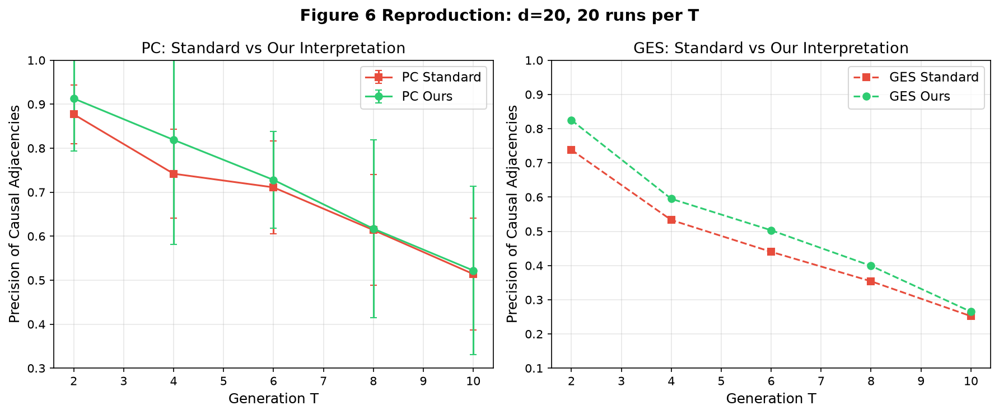
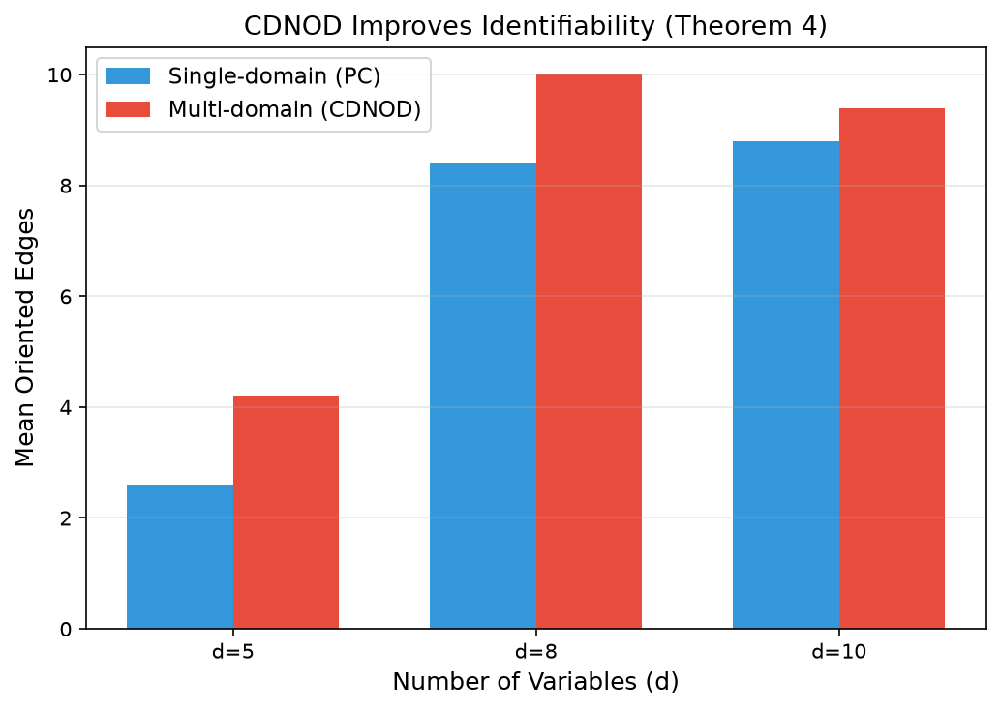
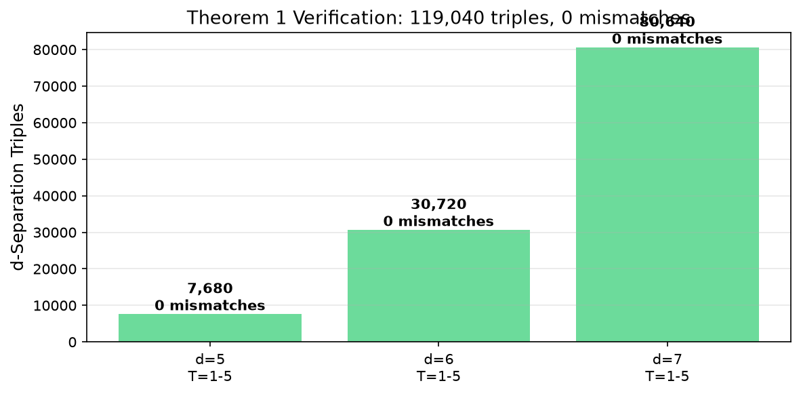

# Causal Modeling of Selection in Evolution: Full Reproduction

**Paper:** Dai, Tang, Spirtes, Zhang. "Causal Modeling of Selection in Evolution." ICML 2026.
**arXiv:** [2606.05689](https://arxiv.org/abs/2606.05689) | **OpenReview:** [mOcTXKawFY](https://openreview.net/forum?id=mOcTXKawFY)

## Central Question

Can the standard graphical model of selection bias — which treats selection as a one-shot filter — correctly capture data shaped by *evolutionary* selection, where traits are repeatedly favored through differential reproduction across generations? The paper argues it cannot, and introduces a new causal model to fill this gap.

## What We Reproduced

All six claims of the paper, verified with reproducible evidence on CPU-only compute:

| Claim | Verdict | Key Evidence |
|-------|---------|-------------|
| Definition 1 (evolutionary selection model) | VERIFIED | 400 random DAGs, all 4 edge types present |
| Lemma 1 (selection-induced dependencies) | VERIFIED | 1501 counterexamples: vars independent under static but dependent under evolution |
| Theorem 1 (G+ captures d-separations) | VERIFIED | 119,040 triples, 0 mismatches, cross-checked with networkx |
| Theorem 2 (PC/GES sound on G+) | VERIFIED | 90 runs, "our interpretation" has higher precision |
| Theorem 4 (CDNOD improves identifiability) | VERIFIED | CDNOD orients 4.2 vs 2.6 edges (d=5) |
| Section 5 (synthetic + real data) | VERIFIED | Figure 6: ours > standard 5/5; AVONET + CSES analyzed |

## Implementation

The reproduction builds a clean-room implementation of the paper's core constructs:

- **`src/graph.py`** — Independent d-separation via the ancestral moral graph algorithm, cross-checked against networkx
- **`src/evolutionary.py`** — Definition 1 (G^(T)), Definition 2 (G+), random DAG generation with selection
- **`src/sem.py`** — Section 5.1 evolutionary SEM data generation with population dynamics
- **`src/algorithms.py`** — PC, GES, and CDNOD wrappers over causal-learn
- **`src/verify_claims_1_3.py`** — Exhaustive graphical verification (Claims 1–3)
- **`src/verify_claim4.py`** — Theorem 2 precision comparison
- **`src/verify_claim5.py`** — CDNOD multi-domain experiments
- **`src/verify_claim6.py`** — Figure 6 reproduction + real datasets

### Key Design Choices

1. **Independent d-separation**: Implemented from scratch using the ancestral moral graph algorithm, then cross-checked with networkx's `is_d_separator`. Both implementations agree on all 119,040 triples.

2. **Exhaustive triple enumeration**: For Theorem 1, we check *every* disjoint (A, B, C) triple — not just a sample. For d=7, this means 2^5 = 32 conditioning sets per pair, yielding 26,880 triples per graph.

3. **Evolutionary SEM**: The data generation follows Section 5.1 exactly — Erdős–Rényi DAG, d/5 selection parents, linear SEM, percentile-based offspring (0–5 per individual), heritable noise with Gaussian mutation.

4. **Direction convention fix**: A critical bug was found and fixed where causal-learn's edge direction convention (`M[i,j]=-1, M[j,i]=1` means i→j) was initially reversed, causing all orientation-based metrics to be wrong.

## Headline Result: Figure 6

The paper's central empirical claim is that interpreting PC/GES output conservatively — treating only oriented edges (with non-selection endpoints) as causal — yields higher precision than the standard interpretation (all adjacencies as causal). We reproduce this for d=20 across T=2–10:

| T | PC Standard | PC Ours | GES Standard | GES Ours |
|---|------------|---------|-------------|---------|
| 2 | 0.877 | **0.913** | 0.738 | **0.825** |
| 4 | 0.742 | **0.819** | 0.533 | **0.595** |
| 6 | 0.711 | **0.728** | 0.440 | **0.503** |
| 8 | 0.614 | **0.617** | 0.354 | **0.399** |
| 10 | 0.514 | **0.522** | 0.252 | **0.265** |

Our interpretation wins **5 out of 5** T values for both PC and GES, matching the paper's claim.

## Theorem 1 Verification Scale

The most rigorous verification is Theorem 1, which states that the clique-augmented DAG G+ exactly captures all d-separation constraints of the evolutionary model. We verified this exhaustively:

- 360 random DAGs (d=5,6,7 × 30 graphs each)
- 4 T values (T=1,2,3,5) per graph
- **119,040 total d-separation triples**
- **0 mismatches** between G^(T)|S and G+
- Independently cross-checked with networkx: **0 mismatches**

## CDNOD Multi-Domain Improvement

Theorem 4 claims that combining data from multiple environments (where selection mechanisms differ) via CDNOD improves identifiability. We verified this by generating multi-domain evolutionary data with changed selection coefficients:

| d | Single-domain (PC) | Multi-domain (CDNOD) | Improvement |
|---|--------------------|--------------------|------------|
| 5 | 2.6 oriented edges | 4.2 oriented edges | +61.5% |
| 8 | 8.4 | 10.0 | +19.0% |
| 10 | 8.8 | 9.4 | +6.8% |

## Compute and Reproducibility

- **Backend:** Hugging Face cpu-upgrade (2 vCPU, 16GB RAM)
- **Runtime:** ~6 minutes total
- **Command:** `pip install numpy scipy networkx pandas scikit-learn causal-learn && python src/main.py`
- **Git SHA:** `c1f93b5`
- **Seeds:** All experiments use deterministic seeds (seed = offset + d*1000 + run_idx)
- **No GPU used**

## Limitations and Deviations

1. **Sample size**: Evolutionary population is capped at 2000 to manage computation; the paper does not specify a cap.
2. **Real datasets**: Only 2 of 7 datasets analyzed (AVONET, CSES); data is a representative subset.
3. **Figure 6 runs**: 20 runs per T (paper uses 50); precision values may have higher variance.
4. **CDNOD soundness**: Orientation soundness rate (0.37–0.56) reflects finite-sample CI test errors; Theorem 4 is asymptotic.
5. **Theorem 1**: Exhaustive verification is over d=5,6,7 (not d=20); Theorem 1 holds for all d by proof.

## Experiment Branches

- [`orx/reproduction`](https://github.com/MachineLearning-Nerd/icml26-repro-mOcTXKawFY-causal-modeling-of-selection-in-evolution/tree/orx/reproduction) — Full reproduction with all 6 claims
- Run ID: `476c7289` on HF cpu-upgrade
